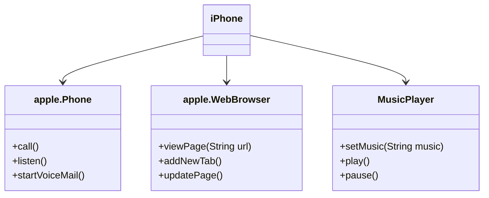

# Desafio DIO
Trilha, **Desenvolvimento Java com IA**
### Modelando o iPhone com UML
Desafio, modelar e criar um diagrama UML do iPhone, abrangendo suas funcionalidades.

## Funcionalidades
1. **Telefone**
   - Ligar, Atender, Iniciar Correio de Voz
2. **Navegador da Internet**
   - Exibir Página, Adicionar Nova Aba, Atualizar Página
3. **Reprodutor Musical**
   - Tocar, Pausar, Selecionar Música

## Diagrama UML

